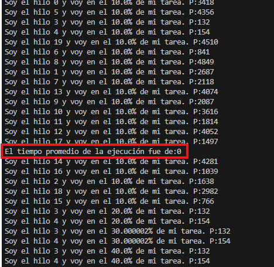
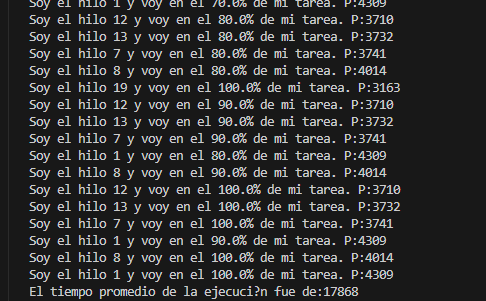

# Lab 2 - Barrier Synchronization Pattern

**Author:** Daniel Esteban Rodriguez Suarez

---

## Description

This project demonstrates a classic concurrency problem where multiple threads perform the same task at different speeds, and the main thread must wait for all of them to finish before computing the average execution time.

The exercise is divided in two parts:
1. Identifying the concurrency bug in the original code.
2. Fixing it using the **Barrier Synchronization Pattern** with `CyclicBarrier`.

---

## Part 1 - Bug Analysis

### What does the program do?
The program creates 20 threads (`HiloProc`), each performing the same task at a random speed. After starting all threads, the main thread reads each thread's result and computes the average execution time.

### What result was obtained?



### Why does this happen?
The main thread reads `getResultado()` immediately after calling `start()` on all threads, **without waiting for them to finish**. Since the threads have barely started executing at that point, `resultado` is still `0` in all of them, producing an incorrect average.

---

## Part 2 - Solution

To fix the concurrency bug, the **Barrier Synchronization Pattern** was applied using Java's `CyclicBarrier` class from `java.util.concurrent`.

### What is CyclicBarrier?
`CyclicBarrier` is a synchronization mechanism that forces a set of threads to wait for each other at a common point. Once all threads reach that point, they are all released and execution continues.

### Changes in `HiloProc.java`
- Added a `CyclicBarrier` attribute to the class.
- Modified the constructor to receive the barrier as a parameter.
- At the end of the `run()` method, after saving the execution time in `resultado`, each thread calls `barrier.await()` — this makes the thread wait until all other threads have also finished.

### Changes in `Main.java`
- Created a `CyclicBarrier` instance with `numHilos` (20) as the number of participants.
- Passed the barrier to each `HiloProc` constructor.
- After starting all threads, the main thread calls `barrier.await()`, which blocks it until the last thread finishes. Only then does it proceed to compute and print the correct average execution time.


## How to Run

### Prerequisites
- Java JDK 8 or higher

### Compile
```bash
javac -d bin src/edu/eci/arsw/samples/*.java
```

### Run
```bash
java -cp bin edu.eci.arsw.samples.Main
```

### Expected output after fix
All threads should complete their tasks before the average is printed, and the result should reflect the actual execution times instead of `0`.

### Actual output after fix



---

## Key Concepts

- **Race condition:** when the result of a program depends on the timing of uncontrolled events (like thread scheduling).
- **Barrier Synchronization:** a pattern where multiple threads must all reach a certain point before any of them proceeds.
- **CyclicBarrier:** a Java class (`java.util.concurrent`) that lets a set of threads wait for each other at a common barrier point.
